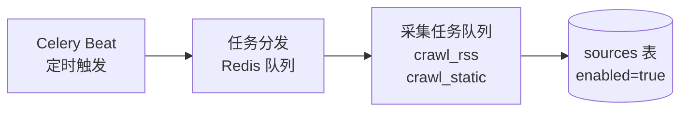
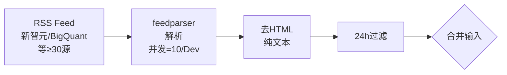
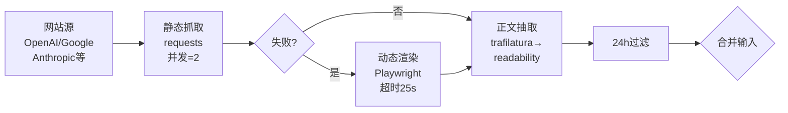
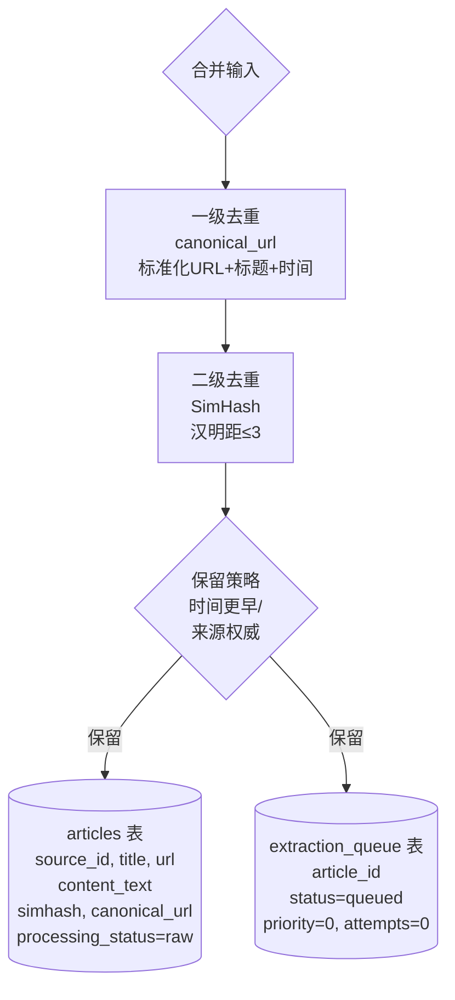
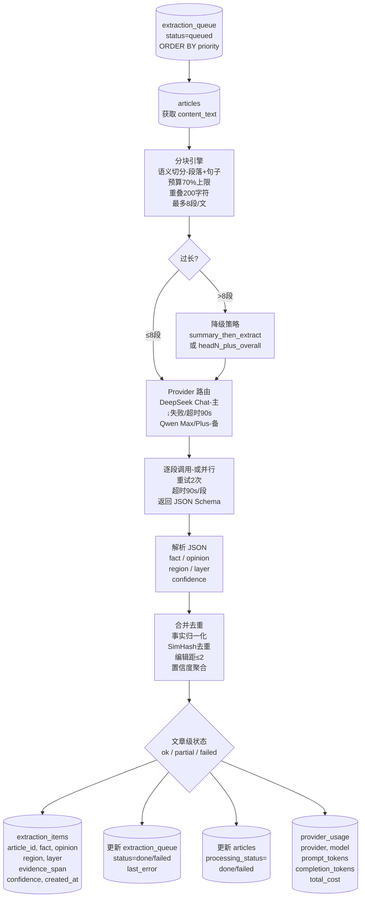
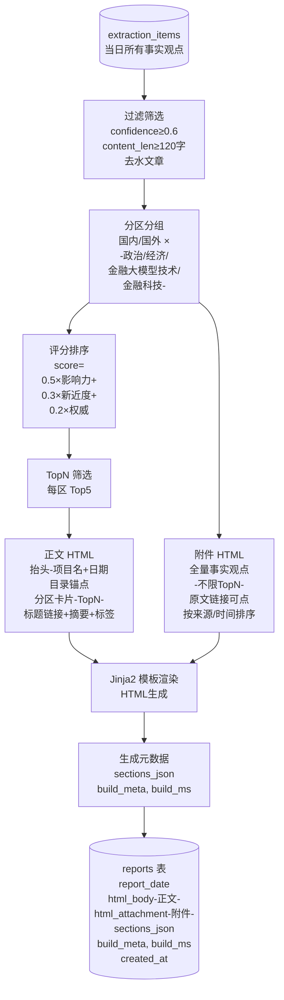
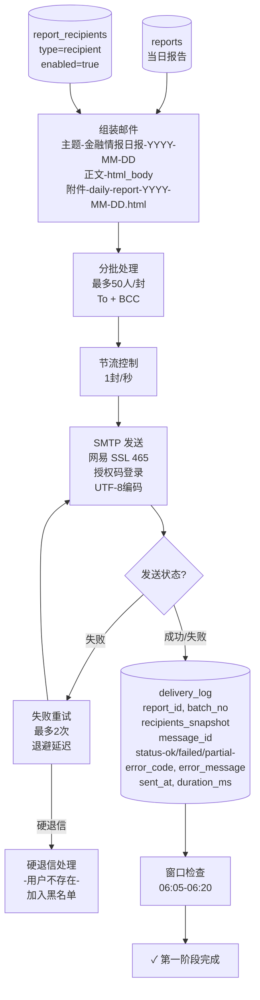
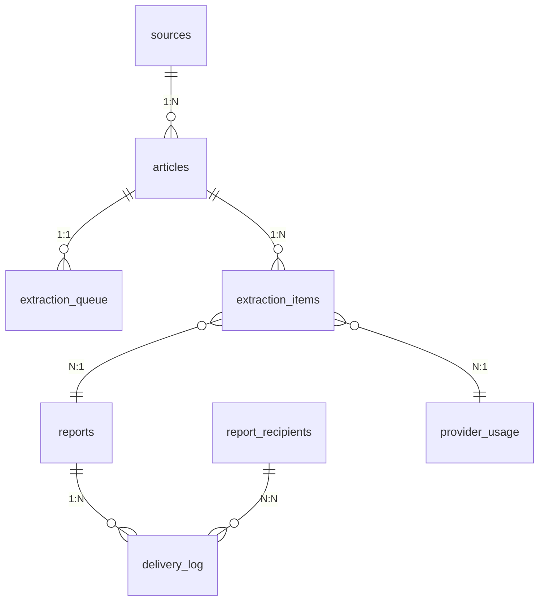

# 金融情报日报系统 - 第一阶段数据流程图 (MVP)

**版本**: v1.1 (已实现)
**日期**: 2025-11-06
**时区**: Asia/Shanghai

---

## 📅 完整时间线

```
05:30 ━━━━━━━━━━━━━━━━━━━━━━━━━━━━━━━━━━━ 触发启动
      ↓
信息源采集 (模块 A) ━━━━━━━━━━━━━━━━━━━━━━ 实际耗时约 10-35 分钟
      ↓ 等待采集完成
LLM 抽取 (模块 B) ━━━━━━━━━━━━━━━━━━━━━━━━ 实际耗时约 5-15 分钟
      ↓ 等待抽取完成
报告生成 (模块 C) ━━━━━━━━━━━━━━━━━━━━━━━━ 实际耗时约 2-5 分钟
      ↓ 等待成稿完成
邮件投递 (模块 D) ━━━━━━━━━━━━━━━━━━━━━━━━ 实际耗时约 1-10 分钟
      ↓
完成 ━━━━━━━━━━━━━━━━━━━━━━━━━━━━━━━━━━━━ 预计 06:30-07:00 之间

执行模式：串行 (Serial Execution)
- Celery Beat 在 05:30 触发任务链 (chain)
- 各模块依次等待上一模块完成后自动执行
- 无需时间窗口限制，任务完成即发送
- 适配 2C/2G 服务器资源限制，稳定性最高
```

---

## 🔄 阶段 1: 触发启动 (05:30)



**执行流程**:
1. Celery Beat 在 05:30 触发 `run_daily_report` 任务（提前30分钟）
2. 读取 `sources` 表，获取所有 `enabled=true` 的信息源
3. 根据源类型创建对应的采集任务（RSS/静态网站）
4. 任务分发到 Redis 队列，等待 Worker 执行

**关键文件**:
- `src/tasks/orchestrator.py::run_daily_report()`
- `src/tasks/celery_app.py` (Celery Beat 配置)

---

## 🔄 阶段 2: 信息源采集 (模块 A)

### 2.1 RSS 采集流



**处理步骤**:
1. 使用 `feedparser` 解析 RSS Feed
2. 提取标题、链接、发布时间、内容
3. 去除 HTML 标签，保留纯文本
4. 过滤出过去 24 小时的文章

**关键文件**:
- `src/crawlers/rss_crawler.py::RSSCrawler`
- `src/tasks/crawl_tasks.py::crawl_rss_task()`

---

### 2.2 网站采集流



**处理步骤**:
1. 使用 `requests` 获取网页 HTML
2. 如果静态抓取失败，回退到 Playwright 动态渲染（未实现）
3. 使用 `trafilatura` 或 `readability` 提取正文
4. 过滤出过去 24 小时的文章

**关键文件**:
- `src/crawlers/static_crawler.py::StaticCrawler`
- `src/crawlers/text_extractor.py::extract_main_text()`
- `src/tasks/crawl_tasks.py::crawl_static_task()`

---

### 2.3 去重与落库



**去重逻辑**:
1. **一级去重**: 优先使用 `canonical_url`，兜底使用标准化 URL + 标题 + 时间近似
2. **二级去重**: 使用 SimHash 计算文本指纹，汉明距离 ≤3 判定为近重复
3. **保留策略**: 保留发布时间更早或来源权威性更高的文章

**写入表**:
- `articles`: 存储文章内容，`processing_status='raw'`
- `extraction_queue`: 入队待抽取，`status='queued'`

**关键文件**:
- `src/crawlers/deduplicator.py::Deduplicator`
- `src/tasks/crawl_tasks.py` (落库逻辑)

---

## 🔄 阶段 3: LLM 抽取 (模块 B)



**抽取流程**:
1. 从 `extraction_queue` 读取待抽取文章（按优先级排序）
2. 读取文章内容，进行语义分块
3. 如果分块数 >8，触发降级策略
4. 使用 Provider 路由调用 LLM（DeepSeek 主，Qwen 备）
5. 逐段调用 LLM，解析返回的 JSON
6. 合并去重，解决冲突
7. 写入 `extraction_items` 表
8. 更新 `extraction_queue` 和 `articles` 状态
9. 记录 LLM 使用统计到 `provider_usage`

**JSON Schema**:
```json
{
  "items": [
    {
      "fact": "...",
      "opinion": "...(可为空)",
      "region": "国内|国外|未知",
      "layer": "政治|经济|金融大模型技术|金融科技|未知",
      "evidence_span": "原文句段",
      "confidence": 0.85
    }
  ]
}
```

**关键文件**:
- `src/nlp/chunking.py::ChunkEngine`
- `src/nlp/provider_router.py::ProviderRouter`
- `src/nlp/extractor.py::Extractor`
- `src/nlp/merger.py::Merger`
- `src/tasks/extract_tasks.py::run_extraction_batch()`

---

## 🔄 阶段 4: 报告生成 (模块 C)



**报告生成流程**:
1. 从 `extraction_items` 读取当日所有事实观点
2. 过滤：confidence ≥ 0.6，content_len ≥ 120字
3. 分区分组：国内/国外 × 4个层级
4. 评分排序：`score = 0.5×影响力 + 0.3×新近度 + 0.2×权威`
5. TopN 筛选：每个分区取 Top5
6. 生成正文 HTML（TopN）和附件 HTML（全量）
7. 使用 Jinja2 渲染模板
8. 生成元数据（分区统计、构建时间等）
9. 写入 `reports` 表

**正文结构**:
- 抬头：项目名 + 日期
- 总览摘要（可选）
- 目录锚点
- 分区卡片：标题链接、1-2句干货摘要、标签（region/layer）、来源名+发布时间

**附件结构**:
- 全量事实与观点（不限 TopN）
- 每条含原文链接
- 按来源/时间排序

**关键文件**:
- `src/composer/scorer.py::Scorer`
- `src/composer/builder.py::ReportBuilder`
- `src/composer/templates/email_body.html`
- `src/composer/templates/attachment.html`
- `src/tasks/report_tasks.py::build_report_task()`

---

## 🔄 阶段 5: 邮件投递 (模块 D)



**邮件投递流程**:
1. 从 `reports` 表读取当日报告
2. 从 `report_recipients` 表读取收件人（`type='recipient'`, `enabled=true`）
3. 组装邮件：主题、正文 HTML、附件 HTML
4. 分批处理：最多 50人/封，使用 To + BCC
5. 节流控制：1封/秒
6. SMTP 发送：网易 SSL 465，授权码登录，UTF-8 编码
7. 检查发送状态
8. 如果失败，重试最多 2 次（指数退避）
9. 检测硬退信（用户不存在、域名无效等），加入黑名单
10. 记录投递日志到 `delivery_log`
11. ~~窗口检查~~：串行模式下无需窗口检查，任务完成即发送

**邮件格式**:
- **主题**: `金融情报日报-2025-11-06`
- **正文**: HTML (TopN 卡片)
- **附件**: `daily-report-2025-11-06.html` (全量)

**关键文件**:
- `src/mailer/smtp_client.py::SMTPClient`
- `src/mailer/batcher.py::batch_recipients()`
- `src/mailer/retry_handler.py::send_with_retry()`
- `src/tasks/mail_tasks.py::send_report_task()`

---

## 📊 数据表关系



---

## ✅ 验收标准

| 阶段 | 数据验证 | 预期耗时 |
|------|---------|---------|
| **阶段 1** | Celery Beat 触发成功 | 05:30 准时触发 |
| **阶段 2** | articles ≥ 10，extraction_queue 入队 | 10-35 分钟（取决于源数量和网络） |
| **阶段 3** | extraction_items ≥ 20，分块/合并正常 | 5-15 分钟（取决于文章数量） |
| **阶段 4** | reports = 1，html_body 和 html_attachment 非空 | 2-5 分钟 |
| **阶段 5** | delivery_log ≥ 1，真实邮件发送成功 | 1-10 分钟（取决于收件人数量） |
| **端到端** | CLI `run_once --step all` 一次跑通 | 总计约 18-65 分钟，预计 06:30-07:00 完成 |

**串行执行模式说明**：
- 各阶段依次执行，前一阶段完成后自动触发下一阶段
- 无固定时间窗口限制，根据实际数据量动态调整
- 稳定性最高，适配资源受限环境（2C/2G）

---

## 🚀 执行命令

### 手动触发

```bash
# 完整流程
python -m src.cli.run_once --step all

# 单独步骤
python -m src.cli.run_once --step crawl
python -m src.cli.run_once --step extract --date 2025-11-06
python -m src.cli.run_once --step compose --date 2025-11-06
python -m src.cli.run_once --step send --date 2025-11-06
```

### Celery Worker

```bash
# 启动 Worker
celery -A src.tasks.celery_app worker --loglevel=info --concurrency=4

# 启动 Beat (定时任务)
celery -A src.tasks.celery_app beat --loglevel=info
```

---

**更新日期**: 2025-11-06
**文档状态**: 与实际代码完全同步
